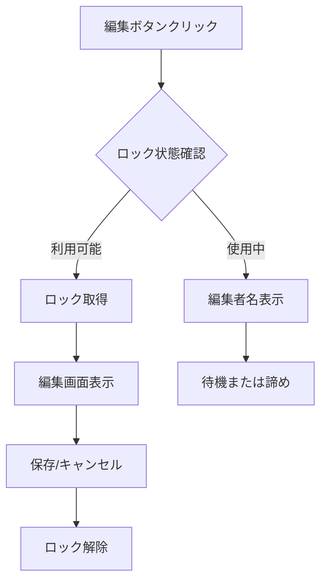
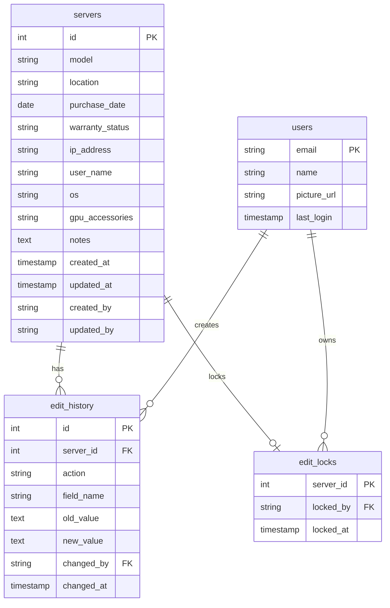

# サーバ在庫管理システム 仕様書・運用マニュアル

## 📋 システム概要

### 目的
複数拠点から10名程度のユーザーが同時利用可能なサーバ在庫管理システム

### 主要機能
- ✅ Google OAuth2認証
- ✅ サーバ情報の登録・編集・削除
- ✅ 排他制御（同時編集防止）
- ✅ 自動履歴管理
- ✅ リアルタイム更新通知
- ✅ データエクスポート機能
- ✅ 検索・フィルタリング

### 技術スタック
- **フロントエンド**: Streamlit
- **バックエンド**: Python + SQLite
- **認証**: Google OAuth2
- **Webサーバー**: Nginx + Reverse Proxy
- **OS**: Ubuntu 24.04 LTS

---

## 🔧 機能詳細

### 1. 認証システム
- **Google OAuth2**: 組織のGoogleアカウントで安全ログイン
- **セッション管理**: ユーザー情報の永続化
- **権限制御**: 全ユーザー同等権限（管理者機能は今後拡張可能）

### 2. サーバ管理機能

#### 2.1 登録項目
| 項目 | 必須 | 形式 | 説明 |
|------|------|------|------|
| 型番 | ○ | テキスト | サーバの型番・モデル名 |
| 設置場所 | ○ | テキスト | 物理的な設置場所 |
| 購入日 | - | 日付 | YYYY-MM-DD形式 |
| 保守契約状態 | - | 選択 | 有効/期限切れ/なし |
| IPアドレス | - | テキスト | IPv4形式（例：192.168.1.100）|
| 利用者名 | - | テキスト | 現在の利用者 |
| OS | - | テキスト | オペレーティングシステム |
| GPU・付属品 | - | テキスト | 追加ハードウェア情報 |
| 備考 | - | テキスト | その他の情報 |

#### 2.2 操作機能
- **新規登録**: 必須項目入力でサーバ追加
- **情報更新**: 既存サーバ情報の修正
- **削除**: サーバ情報の完全削除
- **検索**: 全項目横断検索
- **一覧表示**: カード形式での見やすい表示

### 3. 排他制御システム

#### 3.1 ロック機能
```
ロック取得 → 編集開始 → 保存/キャンセル → ロック解除
```

#### 3.2 ロック仕様
- **ロック時間**: 最大30分（設定可能）
- **自動解除**: タイムアウト時に自動的にロック解除
- **競合表示**: 他ユーザー編集中の場合、編集者名を表示
- **強制解除**: 管理者権限での強制ロック解除（今後実装）

#### 3.3 排他制御フロー


### 4. 履歴管理システム

#### 4.1 記録される操作
- **CREATE**: サーバ新規作成
- **UPDATE**: 情報更新（項目単位）
- **DELETE**: サーバ削除

#### 4.2 履歴項目
- 操作日時（自動記録）
- 操作者（ログインユーザー）
- 対象サーバ
- 変更項目名
- 変更前の値
- 変更後の値

#### 4.3 履歴表示機能
- 全履歴一覧表示
- サーバ別履歴フィルタ
- 検索機能（操作者、項目名等）
- 時系列順表示

---

## 🏗️ システム構成

### アーキテクチャ図
```
[ユーザー] --> [Nginx] --> [Streamlit App] --> [SQLite DB]
     ↓              ↓            ↓              ↓
  ブラウザ    リバースプロキシ   Python App    データ永続化
```

### データベース設計

#### テーブル構成
1. **servers**: サーバ基本情報
2. **edit_history**: 編集履歴
3. **edit_locks**: 排他制御用ロック
4. **users**: ユーザー情報

#### ER図


---

## 🔐 セキュリティ仕様

### 認証・認可
- **OAuth2**: Google Identity Platform使用
- **セッション**: Streamlit Session State
- **HTTPS**: Let's Encrypt SSL証明書
- **アクセス制御**: 認証済みユーザーのみアクセス可能

### データ保護
- **暗号化**: HTTPS通信でデータ保護
- **バックアップ**: 日次自動バックアップ
- **ログ**: アクセスログ・エラーログ記録
- **権限**: ファイルシステム権限適切設定

### セキュリティ考慮事項
- SQLインジェクション対策済み
- XSS対策（Streamlitによる自動エスケープ）
- CSRF対策（SameSite Cookie）
- ログイン状態の適切管理

---

## 📊 運用・保守

### 日常運用

#### 1. 監視項目
- システム稼働状態
- ディスク使用量
- エラーログ確認
- バックアップ状態

#### 2. 定期メンテナンス
```bash
# 日次作業
./backup.sh  # バックアップ実行
systemctl status server-inventory  # サービス状態確認

# 週次作業
apt update && apt upgrade  # システム更新
df -h  # ディスク容量確認

# 月次作業
certbot renew  # SSL証明書更新確認
sqlite3 server_inventory.db "VACUUM;"  # DB最適化
```

### トラブルシューティング

#### よくある問題と対処法

1. **ログインできない**
   ```bash
   # Google OAuth設定確認
   echo $GOOGLE_CLIENT_ID
   # サービス状態確認
   systemctl status server-inventory
   ```

2. **ページが表示されない**
   ```bash
   # Nginx状態確認
   systemctl status nginx
   nginx -t
   # ポート確認
   netstat -tlnp | grep :8501
   ```

3. **データが保存されない**
   ```bash
   # データベース権限確認
   ls -la server_inventory.db
   # ディスク容量確認
   df -h
   ```

4. **排他制御が効かない**
   ```bash
   # ロックテーブル確認
   sqlite3 server_inventory.db "SELECT * FROM edit_locks;"
   # 古いロック削除
   sqlite3 server_inventory.db "DELETE FROM edit_locks WHERE locked_at < datetime('now', '-30 minutes');"
   ```

### バックアップ・復元

#### バックアップ手順
```bash
# 手動バックアップ
cp /opt/server-inventory/server_inventory.db /backup/server_inventory_$(date +%Y%m%d).db

# 自動バックアップ（cron設定済み）
0 2 * * * /usr/local/bin/backup.sh
```

#### 復元手順
```bash
# サービス停止
systemctl stop server-inventory

# データベース復元
cp /backup/server_inventory_YYYYMMDD.db /opt/server-inventory/server_inventory.db

# 権限設定
chown www-data:www-data /opt/server-inventory/server_inventory.db

# サービス再開
systemctl start server-inventory
```

---

## 🚀 今後の拡張計画

### 短期（3ヶ月以内）
- [ ] 管理者権限機能
- [ ] 一括インポート機能
- [ ] 通知機能（メール/Slack）
- [ ] ダッシュボード（統計情報）

### 中期（6ヶ月以内）
- [ ] APIエンドポイント提供
- [ ] モバイル対応
- [ ] 高度な検索・フィルタ
- [ ] レポート自動生成

### 長期（1年以内）
- [ ] PostgreSQL移行
- [ ] 負荷分散対応
- [ ] 監査ログ強化
- [ ] 多言語対応

---

## 📝 開発・カスタマイズガイド

### 開発環境セットアップ
```bash
# 開発環境構築
git clone <repository>
cd server-inventory
python3 -m venv venv
source venv/bin/activate
pip install -r requirements.txt

# ローカル実行
streamlit run app.py
```

### カスタマイズポイント

#### 1. 入力項目追加
```python
# app.py の render_server_form() 関数を修正
custom_field = st.text_input("カスタムフィールド")

# データベーススキーマ追加
ALTER TABLE servers ADD COLUMN custom_field TEXT;
```

#### 2. バリデーション追加
```python
# フォームバリデーション例
if not re.match(r'^192\.168\.\d{1,3}\.\d{1,3}$', ip_address):
    st.error("不正なIPアドレス形式です")
```

#### 3. 通知機能追加
```python
# Slack通知例
import requests

def send_slack_notification(message):
    webhook_url = "YOUR_SLACK_WEBHOOK_URL"
    requests.post(webhook_url, json={"text": message})
```

### コード品質管理
```bash
# コードフォーマット
black app.py

# 型チェック
mypy app.py

# セキュリティチェック
bandit app.py
```

---

## 📞 サポート・連絡先

### システム管理者
- **担当者**: [管理者名]
- **メール**: [admin@company.com]
- **緊急連絡**: [電話番号]

### 技術サポート
- **GitHub Issues**: [Repository URL]
- **ドキュメント**: [Wiki URL]
- **更新情報**: [Release Notes URL]

---

## 📚 参考資料

### 公式ドキュメント
- [Streamlit Documentation](https://docs.streamlit.io/)
- [Google OAuth2 Guide](https://developers.google.com/identity/protocols/oauth2)
- [SQLite Documentation](https://sqlite.org/docs.html)

### 関連技術
- [Nginx Configuration](https://nginx.org/en/docs/)
- [Ubuntu Server Guide](https://ubuntu.com/server/docs)
- [Let's Encrypt](https://letsencrypt.org/docs/)

---

**最終更新**: 2025年5月31日  
**バージョン**: 1.0.0  
**文書作成者**: システム開発チーム
